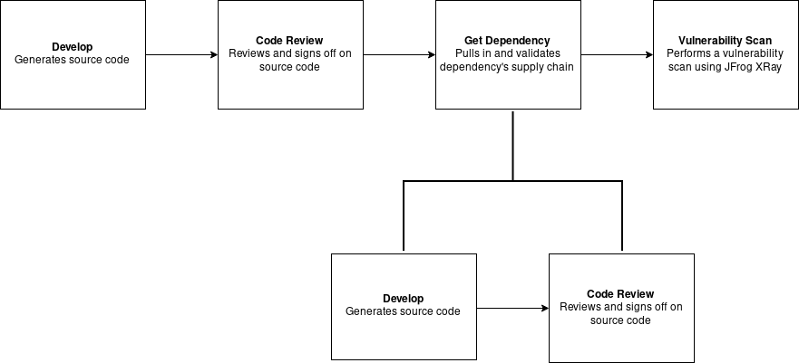

# in-toto SBoM Demo

In this demo, we attempt to use in-toto to create a Software Bill of Materials
(SBoM). Specifically, we look at the components an SBoM must contain and how
in-toto's tooling and specification can be used to generate machine readable
metadata with these components.

For the purposes of this demo, we're defining a simple straightforward supply
chain which includes a few traditional steps such as development and code
review, as well as a mocked vulnerability scan that generates a JSON report.
The metadata generated can be used to check that each step was completed by the
authorized functionary as well as what the vulnerability scan found.

### SBoM User Stories

There is some consensus on what user stories a SBoM must fulfil, and that
allows us to identify what components/information it must contain. Ideally, an
SBoM must be able to show the provenance, pedigree and integrity of the software
and must have the necessary components to do so.

__Provenance__

The SBoM must have information about the chain of custody of the software and
identify the authors and sources of each software component.

__Pedigree__

The SBoM must contain information about the components that make up the software
and can even include more in-depth information such as compilers configurations.

__Integrity__

The SBoM must contain cryptographic information about the software. Integrity
also applies to the SBoM itself - it should be possible to validate the
integrity of the SBoM metadata.

in-toto's specification provides semantics that allow for all of these. It is
therefore a matter of how in-toto is implemented in a software supply chain and
what aspects of the supply chain are recorded. In this demo, we show that the
existing in-toto tooling is capable of generating verifiable SBoMs.

### Overview of the demo supply chains

We have two project owners, a developer, a code reviewer, and a vulnerability
scanner (which generates reports ike those of JFrog Xray). Steps are defined for
each role except the project owners who instead create the
[layout](https://github.com/adityasaky/in-toto-sbom-demo/blob/master/metadata/root.layout)
for the supply chains. Link metadata must be generated for each step and signed
by the authorized functionary, or `in-toto-verify` will fail to validate the
supply chain.



### Download and setup in-toto on \*NIX (Linux, OS X, ..)
__Virtual Environments (optional)__

We highly recommend you install `in-toto` and its dependencies in a python
virtual environment. The following snippet installs
[`virtualenvwrapper`](https://virtualenvwrapper.readthedocs.io/en/latest/)
and creates a virtual environment:

```bash
# Install virtualenvwrapper
pip install virtualenvwrapper

# Create directory for your virtualenvs, default is
mkdir -p ~/.virtualenvs

# Source the scripts (you may want to add this to your shell startup file)
source /usr/local/bin/virtualenvwrapper.sh

# Create and change into a virtual environment, e.g. "in-toto-sbom-demo"
# This will add the prefix "(in-toto-sbom-demo)" to your shell prompt
mkvirtualenv in-toto-sbom-demo
```

__Get  SBoM demo files and install in-toto__
```bash
# Fetch the demo repo using git
git clone https://github.com/adityasaky/in-toto-sbom-demo.git

# Change into the demo directory
cd in-toto-sbom-demo

# Install a compatible version of in-toto
pip install -r requirements.txt
```

*Note: If you are having troubles installing in-toto, make sure you have
all the [dependencies installed on your system](https://github.com/in-toto/in-toto#install-dependencies).*

### Define the supply chain layouts

We're setting up two supply chains - `target` and `dependency` - where the
`target` supply chain consumes the `dependency` supply chain.

The `target` project owner defines what tasks are performed in the `target`
supply chain. Similarly, the `dependency` project owner defines the tasks for
the `dependency` supply chain. The respective owners generate layout files and
sign them with their keys. A script generates the layouts needed for this demo.

```bash
# Create and sign the software supply chain layout on behalf of the owner
cd owner
python create_layout_target.py
python create_layout_dependency.py
```
__Target Supply Chain__

The script will create a `root.layout` file in the `metadata_target` folder in
the repository root. The layout defines the steps `target-develop`,
`target-code-review`, `target-get-dependency`, and `target-jfrog-xray` which
handle code development, code review (a manual process), the import of a package
`dependency`, and a scan for vulnerbailities using JFrog Xray (mocked for this
demo).

__Dependency Supply Chain__

The script will create a `root.layout` file in the `metadata_dependency` folder
in the repository root. The layout defines the steps `dependency-develop` and
`dependency-code-review`. For the purposes of this demo, we're assuming the
developer and reviewer are the same person for both supply chains.

### Develop

This process is carried out by the developer. There is no universal command or
editor for developers to create their programs, so this step has no
`expected_command`. Instead, it expects developers to write code and generate
link metadata for the `products` they created.

```bash
cd ../developer
in-toto-run --step-name target-develop --products ../target/demo.py --key developer --no-command
in-toto-run --step-name dependency-develop --products ../dependency/demo.py --key developer --no-command
```

This generates signed link metadata in the developer's folder, which we move to
the metadata folders in the repository root.

```bash
mv target-develop.7cedd7de.link ../metadata_target/
mv dependency-develop.7cedd7de.link ../metadata_dependency/
```

### Code Review

This process again has no universal command - every team and organization has
their own code review process. Therefore, the functionary for this step merely
generates link metadata indicating that they've signed off on the code review.

```bash
cd ../reviewer
in-toto-run --step-name target-code-review --materials ../target/demo.py --products ../target/demo.py --key reviewer --no-command
in-toto-run --step-name dependency-code-review --materials ../dependency/demo.py --products ../dependency/demo.py --key reviewer --no-command
```

This generates signed link metadata in the reviewer's folder, which we move to
the metadata folders in the repository root.

```bash
mv target-code-review.3b5fef71.link ../metadata_target/
mv dependency-code-review.3b5fef71.link ../metadata_dependency/
```

### Scanning with JFrog Xray (mocked)

This process is expected to make use of the REST APIs provided as part of the
XRay service. However, for , it's a simple script to generate a report similar
to the ones generated by XRay.

```bash
cd ../xray
in-toto-run --step-name target-jfrog-xray --key xray --products ../reports/jfrog-xray-report.json --materials ../target -- python generate_report.py
```

The script generates a JSON file called `jfrog-xray-report.json` in the reports
folder in the repository root. The step generates signed link metadata in the
xray folder, which we move to the metadata folder in the repository root.

```bash
mv target-jfrog-xray.8cf1c499.link ../metadata_target/
```

### Consuming `dependency` in `target`

We use a sublayout to consume the `root.layout` corresponding to `dependency`.
The links for the sublayout must be placed in an appropriately namespaced
directory.

```bash
cd ../metadata_target
ln -s ../metadata_dependency/root.layout target-get-dependency.c1aef77e.link
ln -s ../metadata_dependency target-get-dependency.c1aef77e
```

### Validating this supply chain

We can now validate this entire supply chain using the generated link metadata
and the original layout. Given that we have an inspection to look at the
XRay report, validation of `target` will __fail__ as the report contains a
vulnerability.

```bash
in-toto-verify --layout root.layout --layout-key ../owner/target_owner.pub
```